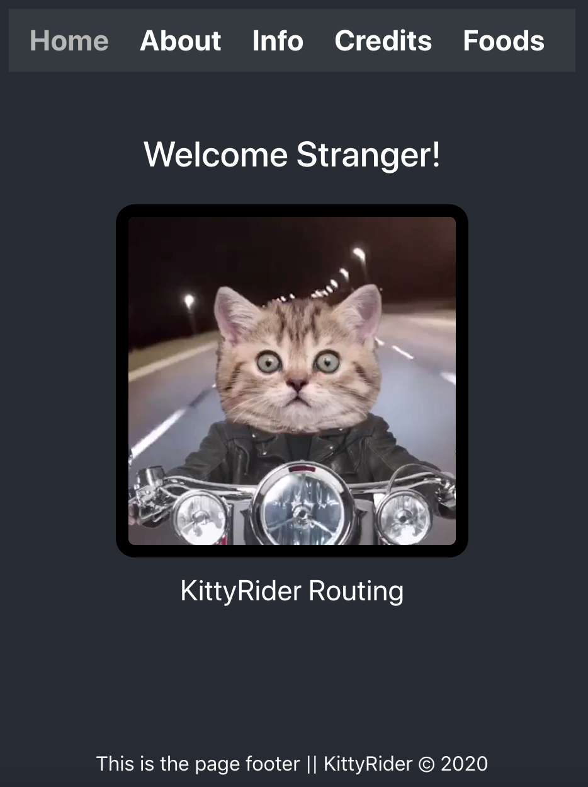

# React Router Website
Create a Webapp/Website using a client-side routing. Your project should contain at least a welcome page, an about page and a credit page. You should display the navigation bar and the footer at all times.

### Requirements

- Organize the project structure properly
- The page will be responsive
- Display nav & footer on all pages (main layout)
- Deploy your project and update the Readme with info about your own project

### Optional:
- use Sass and Bootstrap
- use Nested Routing

## Example

Reference:
 [React Router documentation](https://reacttraining.com/react-router/web)

